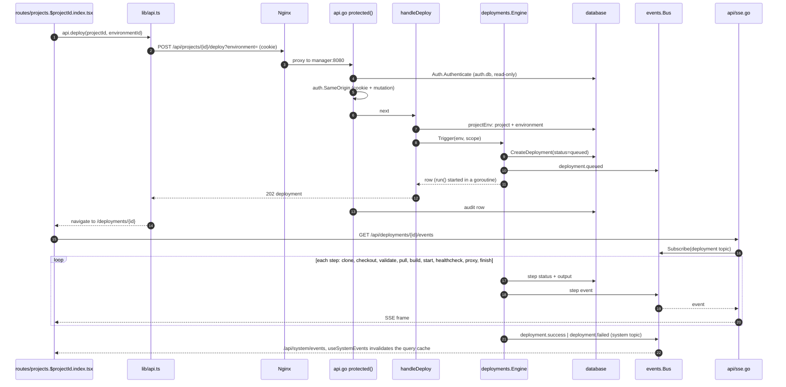
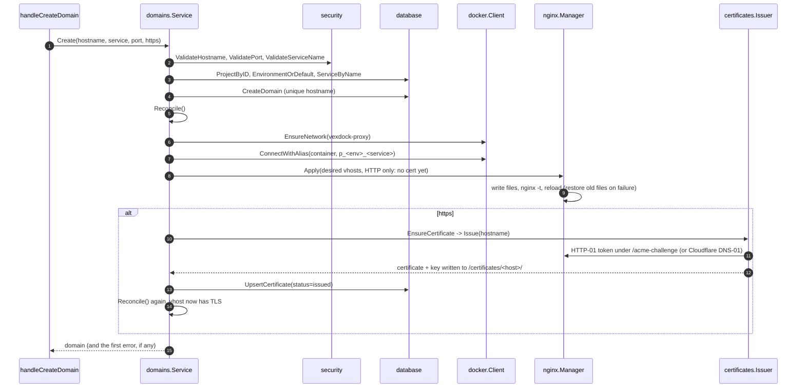
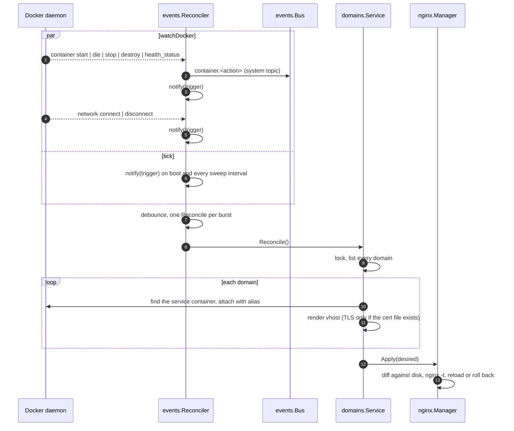
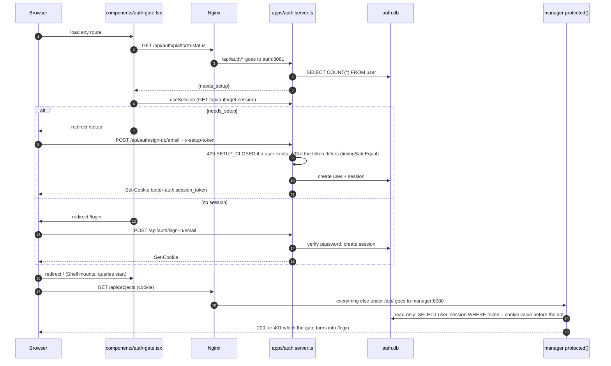
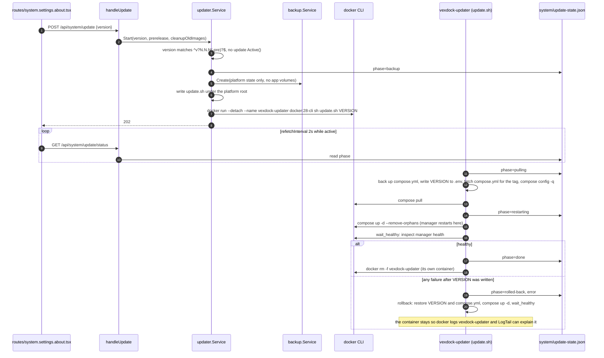

# Reading the code

The first day in this repository. [architecture.md](architecture.md) says why
the system is shaped the way it is; this file says where each piece of that
shape lives in the tree and how a request moves through it.

## Start here

Read in this order, about an hour in total:

1. `manager/cmd/server/main.go`: every subsystem is constructed here and handed
   to the API. The `run` function is the dependency graph in 60 lines.
2. `manager/internal/api/api.go`: the route table, then `protected`, which is
   the whole auth and CSRF story in one function.
3. One handler file, `manager/internal/api/domain_handlers.go`: the pattern
   every endpoint follows.
4. `apps/web/src/lib/api.ts`: the dashboard's only way to talk to the manager.
5. One page, `apps/web/src/routes/docker.networks.tsx`: the pattern every page
   follows.

Every Go package opens with a comment naming what it owns and why it exists.
`cd manager && go doc ./internal/domains` prints one without opening the file.

## Words

| Word | Meaning |
|---|---|
| **Project** | A grouping with a name and tags. Has no source and no containers of its own. |
| **Environment** | A deployable copy of a project (production, staging). Owns the compose project name `p_<ULID>`, the directory under `projects/<id>/` and the services. Every project has a default environment that carries the project's own id. |
| **Service** | One compose service inside an environment. Its `provider` says where it comes from: a git host (`github`, `gitlab`, `bitbucket`, `gitea`, `git`), a published `image`, a pasted `raw` compose fragment, or `unconfigured` (a name and nothing else, skipped on deploy). |
| **Engine** | A catalogue entry for a one-click database: PostgreSQL, MySQL, MariaDB, MongoDB, Valkey, libSQL. Picking one creates an `image` service with a volume and generated credentials, except libSQL, which authenticates with a JWT key rather than a password and starts open to its project network. |
| **Template** | A catalogue entry for a one-click application: n8n, Ghost, WordPress, Umami, Metabase, Grafana, Uptime Kuma, Vaultwarden. Installing one creates a `raw` service per compose service it declares, seeds the passwords and hostname it needs as environment variables, and points the hostname at the service that serves it. Nothing records that a service came from a template. |
| **`managed.yml`** | The one compose file the platform generates per environment from every configured service. The only file ever passed to `docker compose`. |
| **Deployment** | One run of the pipeline for one service of one environment. Has steps, each with a status and captured output. Deploying an environment queues one per service. |
| **Step** | A stage of the pipeline: `clone`, `checkout`, `validate`, `pull`, `build`, `start`, `healthcheck`, `proxy`, `finish`. |
| **Domain** | A hostname mapped to one service and one container port. Gets a generated Nginx vhost and a certificate. |
| **Alias** | The stable name `p_<environment-id>_<service>` a service carries on the `vexdock-proxy` network. Nginx resolves it at request time, so a recreated container needs no proxy change. |
| **Reconcile** | The full convergence pass: attach every domain's container to the proxy network under its alias, render every vhost, `nginx -t`, reload. Runs on Docker events and every two minutes. |
| **Git provider** | A stored connection to a git host (GitHub App, GitLab, Bitbucket, Gitea OAuth) used to list repositories and clone. Distinct from a service's `provider` field, which only says what kind of source it is. |
| **Task** | A cron job that runs a command inside a service's container. |
| **Bus** | The in-process pub/sub in `internal/events`. Everything a browser sees live comes off it. |

## One request, end to end

Pressing **Deploy** on a project page.



1. `routes/projects.$projectId.index.tsx` calls `api.deploy(projectId, environmentId)`
   inside a `useMutation`.
2. `lib/api.ts` `request()` sends `POST /api/projects/{id}/deploy?environment=...`
   with `credentials: 'same-origin'`. No token: the session cookie is the credential.
3. Nginx (`docker/nginx/dashboard.conf`) proxies `/api/` to `manager:8080`. It
   adds `X-Forwarded-Proto` and `X-Real-IP` on the way.
4. `api.go` matches `POST /api/projects/{id}/deploy` and wraps the handler in
   `protected`: `Auth.Authenticate` reads the session out of `auth.db`, then
   because this is a cookie-authenticated mutation, `auth.SameOrigin` compares
   `Origin` with the addressed host. Fail either and the handler never runs.
5. `handleDeploy` in `project_handlers.go` calls `s.projectEnv(w, r)`, which
   loads the project and resolves `?environment=` (falling back to the default),
   then `Deployments.Trigger(...)`.
6. `deployments/engine.go` `Trigger` inserts a `queued` row through
   `database.CreateDeployment`, publishes `deployment.queued` on the bus,
   starts `run` in a goroutine and returns. The handler answers `202` with the
   row; the HTTP request is never held open by a build.
7. `protected` records the mutation in the audit log with the actor, path and
   status.
8. The dashboard navigates to the deployment page, which opens
   `GET /api/deployments/{id}/events`. `api/sse.go` subscribes to the bus topic
   for that deployment and streams every step and output line.
9. `run` takes the per-environment lock, then walks the steps. Each step is
   written to the database and published on the bus as it changes. `start`
   shells out through `internal/compose`; `proxy` calls `domains.Reconcile`.
10. On finish the engine publishes `deployment.success` (or `failed`) on the
    system topic. `lib/sse.ts` `useSystemEvents`, mounted once in the shell,
    listens on `/api/system/events` and invalidates the whole query cache, so
    every page refetches without polling. `internal/notify` sees the same
    event and posts the webhook.

Reads are the same path minus the same-origin check and the audit row.
Anything with a bearer token skips the same-origin check too: a browser never
attaches one on its own.

### Adding a domain

The path from a hostname in a form to a certificate on disk. Everything after
`CreateDomain` is best-effort: the mapping exists even if the proxy or ACME
part fails, and the error tells the user which one did.



### Reconcile on a Docker event

Why a recreated container keeps its domain without anyone doing anything.
The same `Reconcile` runs from the deploy pipeline's `proxy` step, from every
domain mutation, and from here.



A stopped container is skipped with a debug log, not an error, so one dead
service never blocks the config for the rest.

### First boot and sign-in

The auth service owns accounts; the manager only reads them. The setup token
is the whole defence of a fresh panel on a public IP: without it the first
visitor would own the Docker socket.



The gate holds the route back until both queries answer, so an unauthenticated
visitor never mounts the shell and fires a burst of 401s. A bearer
`Authorization` header takes the other branch in `auth.Authenticate`: the
token hash is looked up in the manager's own `api_tokens` table, and the user
row is read from `auth.db` for its current name.

### Self-update

The manager cannot replace its own container, so it launches a detached one
that does. Progress lives in `system/update-state.json`, which is why the
panel can keep rendering while the manager itself is being recreated.



Every error before `docker run` resets the state file to `idle`; every error
after `VERSION` is written goes through `rollback`, never through `set -e`.

## Manager

`manager/` is one Go module, standard library HTTP, SQLite through
`modernc.org/sqlite`, the Docker SDK, and shelling out to `git` and
`docker compose`.

| Package | Owns |
|---|---|
| `cmd/server` | `main`: config, construction, background goroutines, HTTP server |
| `internal/api` | Routes, middleware, one `*_handlers.go` per resource, SSE writer |
| `internal/auth` | Session lookup in `auth.db`, API tokens, the same-origin check |
| `internal/backup` | Snapshots of both databases, proxy config, certificates, volumes |
| `internal/certificates` | ACME issuance (HTTP-01 and Cloudflare DNS-01), uploaded certificate validation |
| `internal/compose` | The `docker compose` CLI wrapper |
| `internal/config` | Environment variables to paths and settings; creates the state directories |
| `internal/database` | The SQLite connection, migrations, models and every query |
| `internal/deployments` | The pipeline |
| `internal/docker` | Docker SDK wrapper: containers, images, volumes, networks, exec, stats |
| `internal/domains` | Hostname to service, proxy attachment, vhost rendering, reconcile |
| `internal/engines` | The database catalogue and the compose fragment each engine renders |
| `internal/events` | The bus and the Docker event reconciler |
| `internal/git` | Clone with credentials, GitHub App JWTs, OAuth for the other hosts |
| `internal/metrics` | Host and container sampling into the metrics tables |
| `internal/nginx` | Vhost generation, `nginx -t`, reload with byte-for-byte rollback |
| `internal/notify` | The outgoing deploy webhook |
| `internal/projects` | Project and environment lifecycle, on-disk layout, `managed.yml` rendering, import/export |
| `internal/schedule` | Cron parsing and the task runner |
| `internal/security` | Validation of anything that reaches a command line, AES-GCM cipher, path confinement, webhook signatures |
| `internal/templates` | The application catalogue: the compose services one entry installs and the values it seeds |
| `internal/updater` | Self-update: state file, the detached updater container, `update.sh` |
| `migrations` | `000N_name.sql`, embedded, applied in order on boot |

Dependency direction: `database` imports only the driver. Business packages
(`projects`, `domains`, `deployments`, ...) import `database`. `api` imports
everything and is imported by nothing but `main`. A cycle will not compile, so
if you find yourself wanting one, the logic is in the wrong package.

### Conventions you will see everywhere

- A handler decodes with `decode`, answers with `writeJSON`, and reports
  failures with `badRequest`, `handleLookupError` or `serverError`
  (`api/respond.go`). Every error is `{"error": {"code", "message", "details"}}`.
- Project routes take `?environment=`; `s.projectEnv(w, r)` resolves it.
- Anything a user typed that will end up in an argv, a file name or a YAML
  file goes through `internal/security` first.
- Secrets are stored through `security.Cipher` and never logged or returned.
- Long work starts a goroutine and answers `202`; progress goes on the bus.
- Every timestamp is `database.Now()`, RFC3339 UTC, so string comparison in
  SQL sorts correctly.
- Logging is `slog`, structured, with a `component` field set at construction.

## Dashboard

`apps/web/` is TanStack Start in SPA mode, built to static files that Nginx
serves. React Query holds server state; component state stays local.

| Path | What |
|---|---|
| `src/routes/*.tsx` | One file per page; the filename is the URL. `projects.$projectId.domains.tsx` is `/projects/:projectId/domains`. A `_` before a dot (`projects.$projectId_.services...`) makes the child render outside its parent's layout. `routeTree.gen.ts` is generated by Vite; never edit it. |
| `src/routes/__root.tsx` | Query client, `AuthGate`, `Shell` around every non-public route |
| `src/components/auth-gate.tsx` | Sends the visitor to `/setup`, `/login` or the app |
| `src/components/shell.tsx` | Sidebar with the project tree, page header, command palette, the one `useSystemEvents` subscription |
| `src/components/primitives.tsx` | The dashboard's vocabulary over shadcn: `Page`, `Section`, `FormSection`, `Cell`, `Field`, `Input`, `Select`, `Button`, `IconButton`, `Confirm`, `Status`, `EmptyState`, ... |
| `src/components/data-table.tsx` | `DataTable` and `columnsFor`; every table on every page |
| `src/components/ui/*` | shadcn output. Pages reach for it only for what `primitives.tsx` has no word for |
| `src/components/*-panel.tsx`, `*-form.tsx` | Pieces shared by more than one route |
| `src/components/env-editor.tsx` | `EnvEditor`: the .env textarea with a line gutter and highlighting |
| `src/lib/api.ts` | Types for every response and one function per endpoint |
| `src/lib/auth-client.ts` | better-auth client: `signIn`, `signUp`, `signOut`, `useSession` |
| `src/lib/sse.ts` | `useEventSource` for one stream, `useSystemEvents` for cache invalidation |
| `src/lib/format.ts`, `dotenv.ts`, `breadcrumb.ts` | Pure helpers, each with a test beside it |
| `src/lib/engine-marks.ts` | Each database engine's own brand logo, as the path its project ships |
| `src/styles.css` | Every design token. A reskin is an edit here, never on a page |

A page is: `useQuery({ queryKey, queryFn: api.something })`, a `useMutation`
per action that invalidates the keys it changed, and a `Page` with the data
inside primitives. Refetch-on-event comes from the shell, so a page never sets
`refetchInterval` for anything the server can announce.

Design rules (tokens, radius, hairlines, the Vercel look) are in
[CONTRIBUTING.md](../CONTRIBUTING.md#conventions).

## Auth service

`apps/auth/src/server.ts` is one `Bun.serve` around better-auth. It owns
sign-up, sign-in, sessions and `auth.db`. Nginx routes `/api/auth/*` there and
everything else under `/api/` to the manager, which opens `auth.db` read-only
to check a session cookie. Sign-up needs the installer's setup token and closes
once one account exists.

## Working on it

| Changing | Command | Where it shows |
|---|---|---|
| Go code | `make dev-up` (rebuilds the manager image) | `:3000`, `make dev-logs` |
| Dashboard, quick loop | `make dev-up` once, then `make web-dev` | `:5173` with HMR, `/api` proxied to the stack |
| Dashboard, as shipped | `make web` | `:3000` at once; Nginx serves `apps/web/dist/client` from the tree |
| A migration | `make dev-up` | applied on boot; watch `make dev-logs` |
| Everything | `make check` | what CI runs, minus shellcheck and the real-Docker smoke test |

`make run` starts the manager alone on `:8080` against `./.vexdock` with debug
logging. Without the auth container only the public routes answer, so it is for
boot-time debugging (config, migrations, Docker connectivity), not for using the
dashboard.

Dev state is `./.vexdock`. `make dev-down` stops the stack and keeps it; delete
the directory to start from nothing.

The manager reads `PLATFORM_*` variables; `internal/config/config.go` is the
full list with defaults. `PLATFORM_LOG_LEVEL=debug` is the one you want first.

### Running one test

```sh
cd manager && go test ./internal/nginx/ -run TestRender -v
cd apps/web && bun test src/lib/format.test.ts
```

Go tests sit beside the code as `*_test.go`; dashboard tests are `*.test.ts`
beside the module. Tests cover logic that can fail silently (generation,
parsing, validation, encryption, terminal states of a deployment).
`scripts/smoke-test.sh` runs the real path against a running stack.

## When a thing does not fit

- A new endpoint: [AGENTS.md](../AGENTS.md#recipes) has the recipe, and the
  two places the API is described that must change together.
- A new page or a new section of a page: same file.
- Why something is the way it is: [architecture.md](architecture.md) for the
  design, [security.md](security.md) for anything touching input, secrets or
  the command line.
